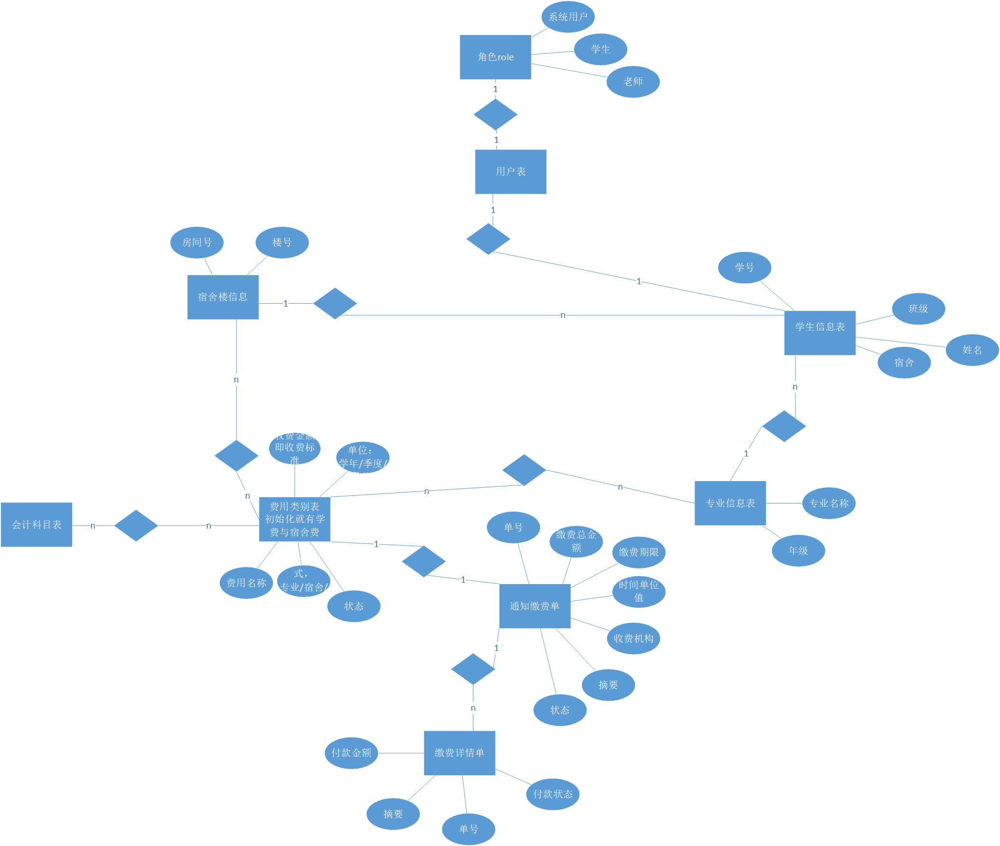

# 一、收费管理模块

## 1.费用类别

1. 系统初始化写死学费与宿舍费，但是收费标准和时间单位是由用户确定的。无法删除，无法修改。
2. 新增一个缴费通知单时，通过**按专业或者按宿舍或者按角色来收取。**在费用类别设置好收费方式后，缴费通知单用用户选取相应的列表。
3. 新增缴费通知单时根据收费的具体用户来计算出一个总金额，供用户查看。在新增时填写收费金额
4. 宿舍费是根据房间号和楼号来确定到具体的用户。学费则是根据年级和专业来确定用户的。
5. 需要在现有的代码上修改页面，新增收费标准设置，收费方式设置，会计科目设置。展示页需要修改成点击就可以查看详情，需要加状态列。
6. 费用类别设置不需要金额。

## 2.通知缴费单与缴费单详情

2. 发起缴费时，会选择会计科目（这里需要查资料确定具体对应哪些科目）。每个费用对应的会计科目是不一样的。
3. 需要加一个总金额。

## 3.其他需要填坑的地方

- [ ] 1.缴费单详情的打印预览跟打印操作。报表
- [ ] 2.通知缴费的实现。消息队列。
- [ ] 3.审核缴费通知单。工作流。
- [ ] 4.单号的生成规则。
- [ ] 5.付款的操作。支付宝。

## 数据库大体的设计

